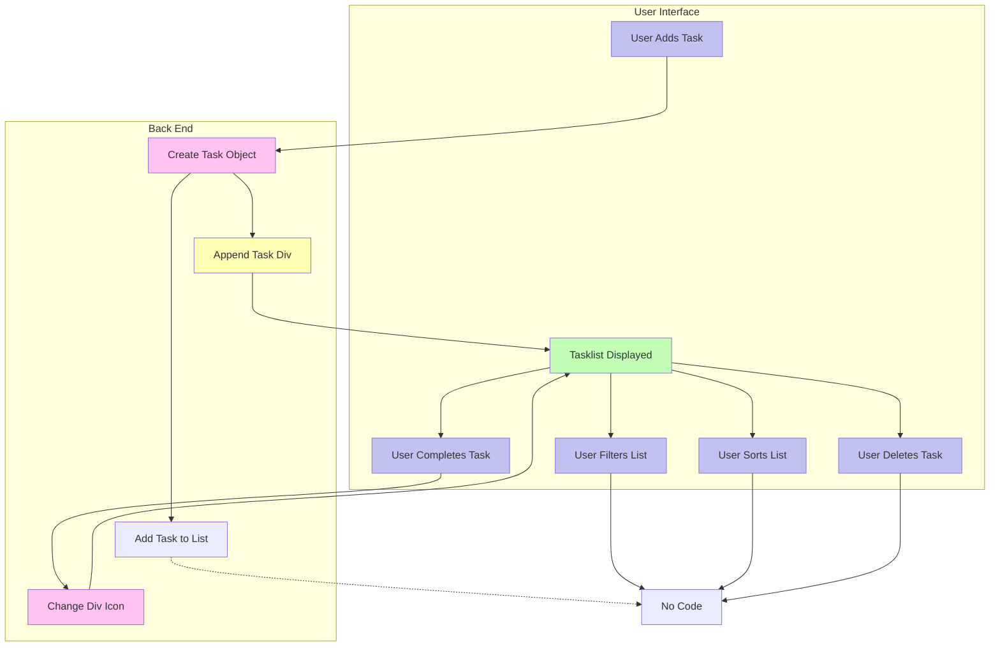
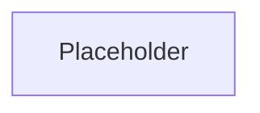

# ToDoodle

## Links

### Repo Docs

- [Ideas Scratchpad](docs/ideas.md)
- [Pseudocode Scratchpad](docs/pseudo.js)
- [Links to Utilities & Inspiration](docs/utilities.md)

### Resources

- [The Advantages of the Template Element](https://codepen.io/oliverjam/pen/yLNEOQO?editors=1010)

## How It Works

### Current Version

### End Goal

