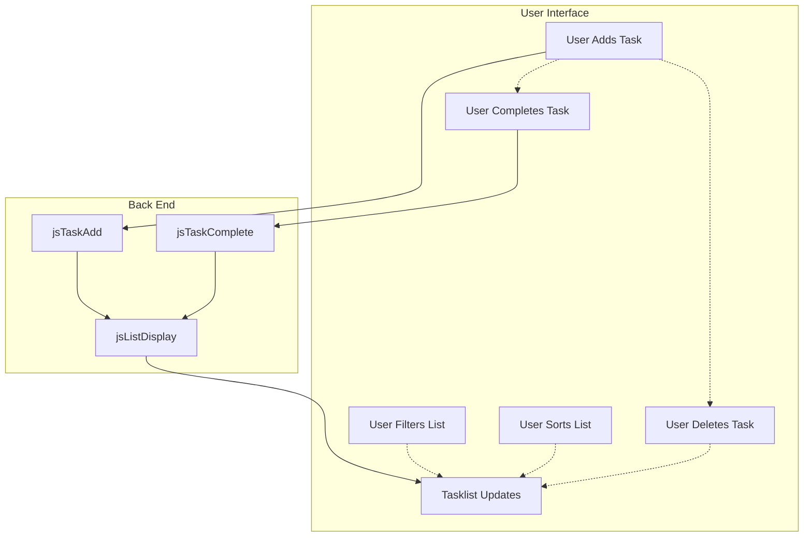

# ToDoodle

## Documents

- [Ideas Scratchpad](docs/ideas.md)
- [Pseudocode Scratchpad](docs/pseudo.js)
- [Links to Utilities & Inspiration](docs/utilities.md)

## How It Works

```mermaid
graph TB
subgraph user[User Interface]
    userListFilter[User Filters List]
    userListUpdate[Tasklist Updates]
    userListSort[User Sorts List]

    userTaskAdd[User Adds Task]
    userTaskComplete[User Completes Task]
    userTaskDelete[User Deletes Task]
end

subgraph code[Back End]
    jsListDisplay

    jsTaskAdd
    jsTaskComplete
end

userTaskAdd ---> jsTaskAdd
userTaskComplete ---> jsTaskComplete
jsTaskAdd & jsTaskComplete ---> jsListDisplay ---> userListUpdate

userListFilter -.-> userListUpdate
userListSort -.-> userListUpdate
userTaskAdd -.-> userTaskComplete
userTaskAdd -.-> userTaskDelete
userTaskDelete -.-> userListUpdate
```
